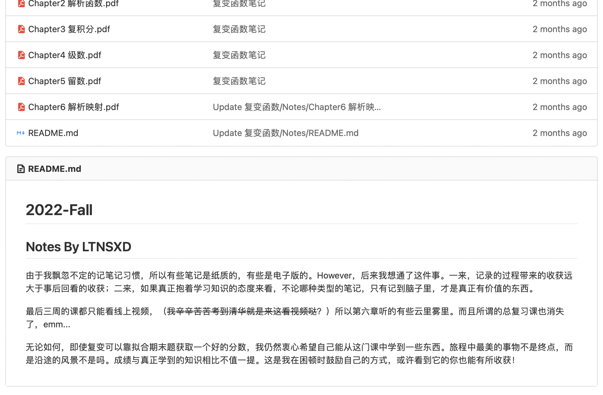
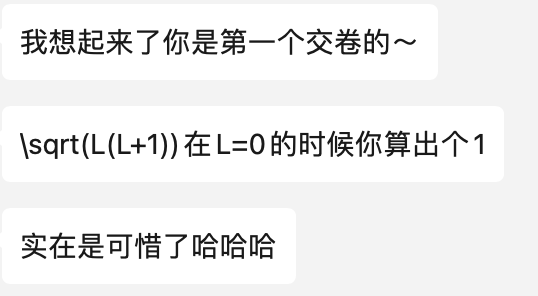
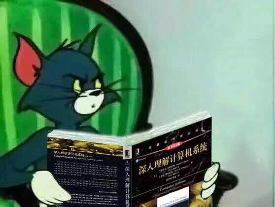

# 前言

受疫情、小学期的影响，严格意义上的2022秋季学期，从9月11日开始，直至第二年的3月2日才结束。七个月啊，七个月，事后回看这段日子我才发现其中的荒唐。我发觉我的内心已经完全变了样，以至于对这个世界的看法已不如前，最终对曾经熟悉的周遭事物感到可怕的割裂感。所以我写了又删，删了又写，最终还是~~没有~~完成这篇Summary。

2022Fall对我的打击是巨大的，直到现在我仍然觉得过去的一学期是一场煎熬。我并没有在炼狱中生存下来。由于太多压力降临在我身上，我变成了一个极度孤僻的人。我没能留住曾经在我身旁的朋友，也没能鼓起勇气认识新的同学。事实就是这样，我已经陷进了名为孤独的泥沼中。没人能够拯救我。

无论如何，那些发生的事已经不重要了，重要的是它们最终作用到我身上，给我带来的感悟与成长。我一直是这么想的。因此，请不要因为我记下的这些话而对我产生怜悯之情。我更想让他人看见的，是我对生活的思考，还有痛苦过后的蜕变。收起你泛滥的共情吧，在我哭泣时请不要拭去那些眼泪，这是我最后的诉求。

# 生活

我原本想尽我可能详实地记录2022Fall发生的每一件事，可惜时间已经过去太久，我已经不能记得发生那些事情时我的感受。再加上我没有记录生活的好习惯，所以这一部分恐怕要被阉割了。但这真的是一件很可惜的事，2022Fall发生了太多太多，包括疫情，感情等方面的巨大转变，更何况在华子读书本就无异于在监狱中坐牢。所以为了不写下不真实的故事，我只能简单说说，希望你能代替`LTNSXD`来还原这些场景。

## 娱乐

除了国庆的三天假期，2022Fall没有娱乐。在这三天里我带领的GRF参与了新雅院赛，不出所料被人打爆了。

## 疫情

来清华之前在紫清被关了七天，还是和轩导一起被关的。他老是抢我鼠标垫（打游戏）。

人民反封控的情绪达到了巅峰。群众进行了革命。被人主观意志控制的这么一场疫情结束了。

十二月以后，宿舍就剩我一个人了。清华大学也变得空荡荡，我一个人在学校里享受孤独。

## 感情

和曾经的友人分开了，我记得那晚走到了荷塘边，我哭成了一个泪人。

和`serein`交流了很多很多。我以为两个抑郁的人交流会像《声之形》一样，是一种互相拯救。事实也确实如此。

~~寒假时我尝试找了十分在意的某位友人，但得到了令人心碎的反馈。~~

## 学习

期中后基本没去上过一次课，每天都在床上睡觉。好在可以缓考，所以我缓了物理让自己舒服一些。

成绩还是不上不下，其实甚至应该说是非常烂，但我已经尽力了。

还在后悔去了CST而不是数学系，后悔来了清华而不是北大。

## 阅读

现实主义小说：《一句顶一万句》、《许三观卖血记》、《人世间》，读这些真的让我很爽。

荒谬文学（大抵只有这本了）：《局外人》。

# Finals

## 复变函数引论 A+

我曾经开玩笑地说，这门课只会是拿来给贵系同学们放松的数学课。事实的确如此，2学分的《复变函数引论》，实质的内容只有留数和分式线性映射两个章节，其他都是高中就可以掌握的知识。无系的同学似乎需要学3学分的《数理方程》，感觉比我们累了不少。看来这是清华大学里为数不多的实实在在的“引论”课。

忘记说了，我选的是杨大伯的课（之所以叫杨大伯，是因为老师是杨幂的大伯。一次课上他还谈起他给杨幂起名的经过，因为杨幂是家中第三个孩子。想必看到这里，你已经可以推测出大幂幂名字的由来）。杨大伯的期末考试只出他课上讲的原题，更夸张地，在没有疫情的年代，他会在最后一周带着大家把题库里的题都给过一遍。所以理论上来说只去听最后一次课，期末就可以考好了。不过我并没有这么做，我还是乖乖地去上课了。在最后几周我还把笔记上传到了新雅to计1的仓库里，虽然这个仓库大概没什么人看。

## 物理学(2) A

和清华其他大雾不太一样，新雅物理学这学期学的内容是热学、机械振动（期中前），波动光学、量子物理基础（期中后）。由于FL&A，ICS和DSA的工作量更大，我基本没去上过几节物理课，去了也是在coding。好在期中考的热学我高中化竞有基础，机械振动也考的比较简单，所以期中考了95（-5是因为有一个量子物理的公式没背，说好的只考热和振动呢）。期中以后学习节奏全乱了，波动光学一开始也听不懂，于是在极大的心理压力下选择了缓考。后来复习的时候发现其实也还好，主要是新雅物理学，他考的是真简单啊）最后春气学期考试只做了45分钟就交卷了，果然没检查出轨道角动量算错了，喜提98而错失A+，草。

## 现代生物学导论 A-

这课并不是贵系要求上的，而是新雅通识课组里的一门屑课。感觉这门课和“现代”、“生物学”都扯不上关系，学的内容为了照顾文科生，说是没有超出高中生物，但又存在一些奇奇怪怪的内容。反正我是不懂学这课的意义何在。舍友上了《神奇的免疫》，我觉得随便吊打这课几十条街。要不是它任务量不算太大，我甚至宁愿去上《普通生物学》来替这课。

期末考一共九十多道判断和四道大题，感觉就是拼运气。最后我考了80.5，擦线A-，emm...总体来说屑课一门。

## 马克思主义原理 P

> 直至大二上结束，隽立的思政课依然只有B+和P

花了一志愿抢了王代月老师的马原。确实，王代月老师任务少，给分应当也不错，整个学期的任务只有一篇不超过4500字的读书报告和一次讨论，还有若干次课堂上的小测。只不过我们组选的读书报告截止时间正好是期中，选的书也是《路易波拿巴的雾月十八》这种相当枯燥的历史读物（在我看来）。所以，啊，正好碰上期中周比较忙的时候，我还得看书写报告，导致我后半个学期的节奏完全乱套，从此以后DSA和ICS再也没按时听过课。讨论的时候，我怀疑助教压根没有看过我写的报告（因为我是卡ddl交的，情有可原hhh），整个过程就是无聊，无聊，无聊。凭他们有话说的人辩去吧，我找不到任何学习的乐趣，在这本书中。

最后pre的时候，我们整组都摆了，留戴神一个人准备&pre。戴神牛逼，他还是腾出时间来干这事儿了。虽然我们最后pre的分不怎么好，但我摆了，有人替我收拾这烂摊子我已经超级满足了，戴神牛逼。

再后来就可以PF了，果断PF马原。我觉得我真有先见之明，早就预料到2022Fall可以pf，然后马原直接开摆。唯一过意不去的可能只有对我们组内的其他同学，他们得到了一个不怎么好的展示分数，我有责任。

## 离散数学(1) A

是的你没看错，我大二上才来修这门课。而且上课的时间和DSA冲突了，我只能周末找时间补看录像。毕竟我大一在新雅时还没想好来贵系，而且如果真选了的话就有28学分了（这其中还有仅仅只有2学分的大学之道哈哈哈）。离散(1)的内容是数理逻辑与集合论，这两个知识我都在高中就知道了不少，特别是集合论。所以过的挺轻松的，至少我对不起它该有的三学分。

马昱春老师讲的挺好的，人也很温柔，只是受限于**清华大学计算机系的答辩教材**，导致某些知识点看起来还是有些“突兀”了。而且马老师是上课是开雨课堂的弹幕的，所以经常有一些小鬼在上课发一些无关/无端炫技的弹幕，老师还一一耐心回复，真的很影响上课体验。。。

期末考考得挺难的，有许多myc课件上的二级结论或者是一些考场上推不出来的东东，还有一道错题浪费我好久时间。考完的时候心态也是炸的，毕竟过程非常摸爬滚打。最后平均分大概70上下（大概80左右就能拿A-的样子），我考了90.5，不容易，真的不容易。

## 数据结构 B+

如前所述，期中过后的我不知道在做什么，导致ICS和DSA两门课一次都没听过（DSA也摆，真敢啊你）。还好还好还好还好他喜闻乐见的缓考了，要不然1月6号考完离散，我一共只有一天的时间补半学期的课，那样的话我怕是B+都考不到。

除此以外，学DSA还让我明白了一件事，那就是评价一门课程得把授课和考试分开评价。作为一个没有OI基础，大一，18岁才开始写第一个cpp的人来说，我确实学到了许多，邓公课上的很多比喻确实让我理解了很多东西。特别是稍微复杂一些的数据结构，比如各种各样的平衡树什么的。**但是**，这门课的期末考他确实设计得不咋地，从每年只有40来的平均分就可以看出这是一场多么打击人的考试。更何况我们这届还是闭卷，感觉有一种ppt背诵的味道。最后一道设计题我想了四十分钟也没想出来（菜啊，隽立），反正考不过OI佬也考不过认真学了的，拿个B+也不寒碜，hh。

btw，邓公一直非常引以为豪的讲义，我觉得，辅以上课是真的不错的。但正是这个优点导致了它致命的缺点，在该有注解的地方没有注解，或者注解不到位。有些算法直接就只有一张意义不明的图。从这点意义上说讲义比不上课本，更比不上习题解析。我个人觉得课本写的还是相当有水平的，可能这也反映出了我本人的没水平吧= =。

## 计算机系统概论 A+

这门课似乎是今年才有的，以前叫作《汇编语言程序设计》，而且再之前好像是放在小学期上的。选了hwt老师的课，课件和lab完全就是抄CMU的。不过这也有好处吧，一点不换地抄CMU的课件和Lab，至少能在这两个方面保证课的质量，不像贵系其他课，真是各有各的烂法。从这里也能看出国内教学水平和世界顶尖大学的差距，简直不是一星半点。。。

这学期做了三个lab，分别是coroutine，attack lab和malloc lab。戴神帮助了我不少，特别是malloc lab；我严重怀疑他是所有人中性能分卷的最高的（97）。我觉得我的malloc lab也是抄他的为准，从这点就可以看出戴神的码力确实牛逼。

不过这课能拿A+真的是我做梦都想不到的，毕竟期中以后没上过课，然后期末前一个星期二倍速补完了课。考试前我还看到了自己在大学生数学竞赛（非数学组）拿了一等奖，开心。但考试完心态立马就崩了。虽然期末考的不如去年那么难，题量还是挺大的。有一两个空我不会就空着了，没想到考了94。最后似乎没调分，我很好奇这课的优秀率到底有没有30%。

> Cheatsheet 是TLB
>
> 《CSAPP》是Page Table
>
> 考试发生Page fault

## 程序设计基础 A

没什么好说的，补大一上的孽障。选了刘玉身老师的课，老师很负责任，助教也很负责任。反正我是一次课都没去听过，有一次还被查水表了（草）。就是大作业写的有点崩溃，最后居然获得了优秀大作业提名，真的超级震惊。期末考最后一题是LIS，套模版5秒搞掂，走人！

## 形式语言与自动机 A-

选了wsy老师的课，老师很和蔼，讲课也算清楚。感觉我是吃了PF时代的红利，因为许多人把这门课PF了，导致期中、期末的平均分都比去年低**不少**（在卷子难度不增的情况下）。我期中考了89，期末82，这两次的中位数分别为79，70，应该是卡线拿的A-，反正最后总评90飘过。

如果要我给选这门课的同学建议的话，我觉得有两个。一个是期中考尽量好好考，自动机的期中考是开卷的，复习成本不是很大，而且最后一题似乎固定会出互归纳法（也不算难，主要考你会不会而已）。唯一需要注意的是正则语言的文法设计，一般来说分值挺大的（6’一题，很可能错了就是错了）。我期中时就是因为有点绷不住了（想快点考完去玩），两个文法设计，一个粗心-3（这题确实比较难），一个看错题-6，然后最后一个CFG，生成空串的无二义性有点坑，我没留意又被-2，比较亏。身边的同学（特别是计14的各位）好多95+，膜orz。另一个是期末考，把握住能做的题就好，比如说前面基础的60分（判断/选择可能会有一丢丢难，主要是Slide13的内容比较难以理解）。然后25分的设计题，一般来说是RE，PDA，TM都有。PDA的题一般都很难，似乎以前是做出来了直接加总评，震惊。最后是15分的证明，一般来说做出两道题不是问题，出书上定理/PPT证明的概率不小。还有一个（不一定每年都有）的5分附加题，我感觉以往是出书上的原证明，而我们今年出了一个需要思考的。这题做出来也是直接总评+5，只不过雨我无瓜罢了。

## 体育(3) B+

选的是足球，何奇泽老师的，总评89。我觉得这真的让我学到了很多事，也许先前的许多B+，我也是擦线没拿到A-而已（比如说思修，我也是89）。所以说，这些差一点就能上一个台阶的事，如果太在意他们，一个人就容易陷进去。不如早些意识到这种评价方式的不合理，然后逃脱出来。

## 总结

总的来说，好消息是隽立这学期绩点久违地有3.9了（真是秋季学期战神，春季学期拉胯），坏消息是现在PF年代，3.9正好30%。本来想奚落一下那些PF选手们，结果发现自己也p了个马原（那没事了）。Nevertheless，我已经不在意这些事情了。满绩也好，成绩差也罢。既然在这方面我已经做不到最好了，那不如就不再卷了，关心一下和生活有关的那些事吧。

